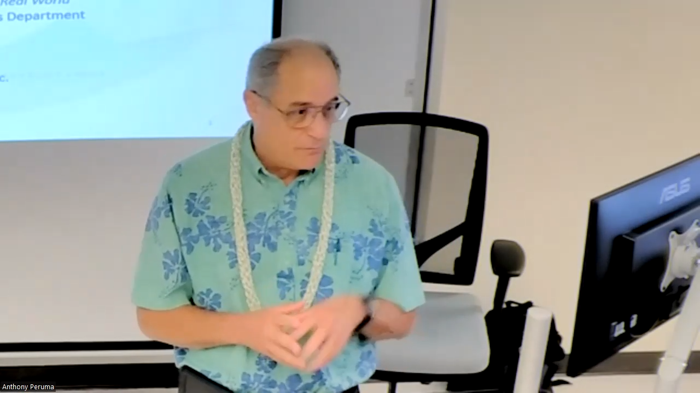

## Thoughts Going In

August 30, 2023 I attended Kevin Costa’s Tech Industry Guest Talk via zoom and at the time I did not really know what to expect except that he would be providing some valuable insight within the software engineering field. Mr. Costa from Business Solution Technologies has had over 35 years of business and information technology experience within both private businesses and government organizations. Currently, he is the Director of Education Solutions at Business Solution Technologies, Inc and so he had a lot of valuable experience that he could share with everyone. 

## Teamwork

A major point Mr. Costa discussed in great detail was the need for teamwork and collaboration without any sort of judgment or disrespect. It was greatly emphasized that when brainstorming, people shouldn’t be afraid to bring up ideas or to speak what is on their mind. After listening to Mr. Costa talked about how important it is to speak up and how it can impact how well a team works together. It made me realize how important it is and that I should practice it before I go out into the real world to work. 

## Commenting is a Necessity
Another major points Mr. Costa discussed during his guest talk session the importance of commenting code. In most cases, students in college might not need to comment on their code as detailed as other people out in the field because they think that everyone knows what is happening in the code and what the code should do since the majority of coding is for homework assigned by professors. However, in the real world, commenting code is absolutely necessary in order for people to understand what might be happening as there are many people working on code and not everyone may know what is happening since people can come and go. It was mentioned that having comments in code can save people a lot of time since programmers wouldn’t need to spend so much time trying to decipher what each line of code means especially if the code wasn’t written by them. Mr. Costa went into great detail on the importance of commenting and the “liberal use” of commenting within code even though it may seem too much. 

Mr. Costa’s explanation of the importance of commenting code has definitely left a great impact on me as I realized the importance of it and how saving time and knowing exactly what something does will mean less stress and less of a chance for mistakes. Additionally, in bigger companies it makes sense to comment a lot since that way co-workers and future employees can have an easier time understanding and will mitigate the possibility of fatal errors. This is especially true for companies like NASA and their spacecraft launches. One small error could possibly lead to a fatal result or it might even take a long time for people to even begin a launch as well. Mr. Costa also did mention NASA having to spend many years and having a large amount of people to work on spacecraft launches. 

## Final Thoughts

As an ICS-314 student, I personally believe this talk was quite valuable and informative as I was able to learn more about this field from Mr. Costa’s insight. I learned that commenting code is extremely important since sometimes it’s not only yourself who is reading the code but other people as well. It also is important since it’ll save you time if you go back to the code and end up forgetting what something does. Being able to work in a team by being open and confident is also something I learned. It makes me realize that I should strive to practice and develop teamwork skills that will help me better impact future teams that I am in such that an agreement on a solution or conclusion can be made more quickly without any argument. Overall, this talk was eye opening and I learned a lot about what I should start to practice in order to be successful in the future. 
