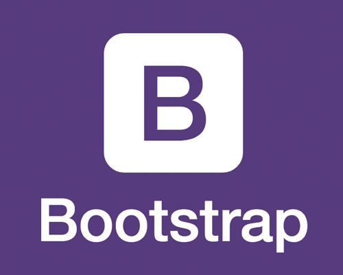

## What is Bootstrap 5?

Bootstrap 5 is a widely-used front-end web development framework that allows developers to create responsive and visually appealing websites as well as applications. It offers a collection of pre-designed UI components, responsive grid systems, and flexible CSS styles, making the process of building modern and mobile-friendly user interfaces much easier. The framework's emphasis on performance optimization, modularity, and customization allows developers to make changes to their projects to meet specific design requirements while ensuring fast loading times and compatibility with various browsers and devices. 

Using Bootstrap 5 offers a large number of advantages for web developers. It significantly accelerates development by providing a lot of pre-built components and styles, reducing the need for people to do their own custom coding. Its responsive grid system ensures websites and web applications function well on various devices and screen sizes which saves time and effort. The modularity aspect of Bootstrap 5 allows for easy customization and selective component usage, enabling individuals to make projects based on what suits them while at the same time keeping file sizes minimal. 

## My Experience

Unfortunately, there is a large learning curve to properly make use of the pre-built components. As I was working on the projects in this class, I found myself constantly needing to refer back to the documentation to figure out what I should use to make a dropdown menu, for example. Additionally, I was not able to do everything in Bootstrap, and so I had to go back to my own style sheet to add a class for white text color or a black background. It would be nice to have these already pre-built into the framework as I feel that they are simple things to make the library more convenient.

Additionally, the framework promotes consistency in design and user experience which helps maintain a professional appearance throughout the applications. It places a strong emphasis  on accessibility allowing people to easily create inclusive web solutions. Furthermore, its massive community support and robust documentation basically guarantees developers with the resources they need to build great web experiences efficiently.

## Overall Thoughts

Investing time and effort in learning and using a UI framework like Bootstrap produces significant benefits that outweigh the learning curve and frustration in the beginning. UI frameworks can lead to improved software engineering practices, encouraging people to practice modular and organized code, as well as providing a foundation for consistent user interfaces, which can enhance the overall user experience and brand identity. In team settings, frameworks like Bootstrap facilitate collaboration by offering a common language and toolset, streamlining development workflows, and reducing communication gaps between designers and developers.
