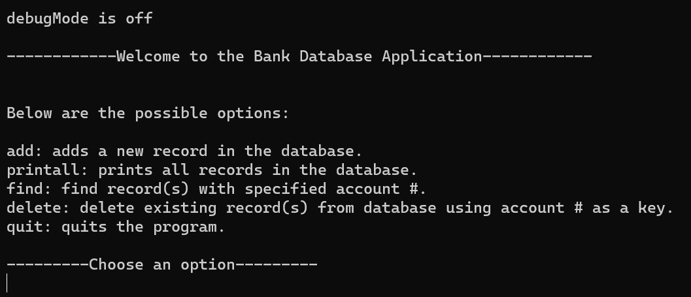
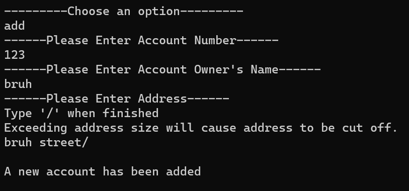
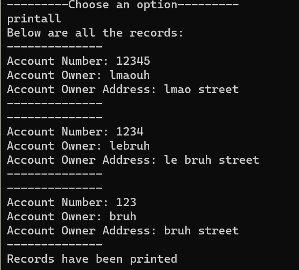

## Introduction

This is a bank database application that stores user information. It stores their name, address, and account number. Users are able to add, find, and delete accounts. The program is also capable of printing out all the accounts within the database. There is also an option to activate a debug mode which would tell the user what options were selected, the information that was inputted, and whether or not a function was properly ran. 

## User Interface



The interface of this application shows a welcome message and provides users with a list of possible options to pick from. It also provides them with a short description of what each option does. At the top, it also provides users with a short message stating whether or not the debug mode is on. 

```c
if (argc == 2 && strcmp(argv[1], "debug") == 0)
{
  debugMode = 1;
  printf("\ndebugMode is on\n");
}

else if (argc > 1)
{
  printf("\nInvalid option, try again please.\n");
  return -1;
}

else
{
  printf("\ndebugMode is off\n");
}
```

## Database



The database utilitzes a Linked List which is where the data is stored. Each account has information containing account number, their address, and the name of the owenr. It also has a pointer to another record within the database. The design of the database is structured in a way so that the account numbers are stored and sorted in descending order.



## Testing

Within this project, testing was conducted to test the functionality and whether or not the program ran as expected. The test plan for this application consisted of over 40 different steps. In the end, the program functioned almost identically to the expected behavior. The creation of the test plan allowed for the practice of creating a test plan and ensuring that it incorporated a variety of scenarios.

## Learning From This Project

This project helped develop skills in database desgining and understanding of the language C. The real life application of this project exposed me to a bit of understanding regarding real world application development. Learning to create a test plan was also a major thing that was learned during this project because without the development of a test plan, a program could completely fail without the programmer knowing. This is a crucial skill in the real world as well since a single error could be detrimental to the success of a company. 

Source: <a href="https://github.com/sam4food/Bank-Database-Application">sam4food/Bank-Database-Application</a>
