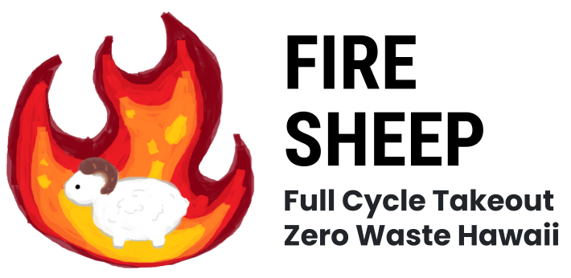
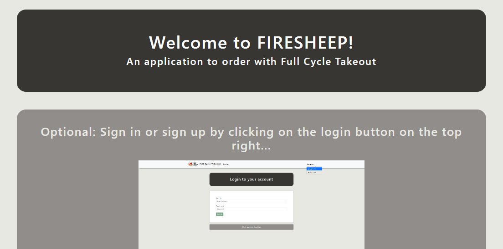
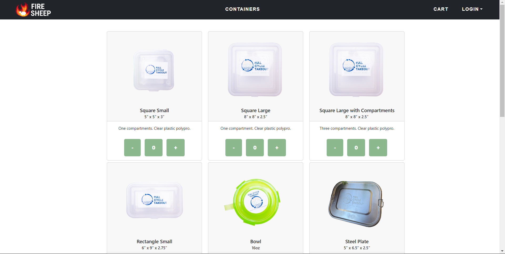

Full Cycle Takeout - A pilot program by the non-profit Zero Waste O’ahu (Zero Waste Hawaii). Their mission is to reduce the waste produced by single-use containers and utensils by renting out re-usable ones. Having a web application will be able to reduce the burden on both customers and the organization. This applications can be modified and applied more generally for use in other places like in UH. Supporting for their own rental or loan services with different types of items.



## What I Learned

We learned about the use of issue-driven project management (IDPM) by breaking down large tasks into manageable components. Each goal was assigned to a team member, and milestones were established to monitor progress. A collaborative atmosphere was maintained, with team members regularly raising issues and engaging in brainstorming sessions for mutual support and feedback.

We implemented acceptance testing to ensure the website's seamless functionality, eliminating the need for manual verification after modifications. This strategy improved project management efficiency, emphasized teamwork, proactive issue resolution, and continuous improvement. It allowed us to adapt to changes in requirements and add new features, demonstrating our commitment to teamwork and adaptability in the face of change.

## Challenges

Testing a program involves a complex process that requires careful planning and attention. It involves designing test cases that cover various scenarios, including edge cases and unexpected inputs, to validate the program's robustness. Balancing manual and automated testing is challenging, as automated tests may struggle with nuanced scenarios that human testers can detect. Managing the testing process within tight timelines and resource constraints is also a challenge. Adapting to evolving requirements and accommodating changes during the testing phase can be challenging. Overcoming these challenges requires a well-structured testing strategy, collaborative teamwork, and an adaptable approach to ensure the program's reliability and functionality.

## Contributions

I mainly focused on the front-end portion of the website's devlopment, creating a user friendly application for people so that they can easily place orders for containers. I was also in charge of creating the tests and testing the program to see if there were any errors within the program. This was crucial for this project as testing helps show whether or not an application is usable. If one test fails, then the program is essentially a failure to an extent. 



```js
import { Selector } from 'testcafe';
import { landingPage } from './landing.page';
import { signInPage } from './signin.page';
import { signOutPage } from './signout.page';
import { navBar } from './navbar.component';
import { searchPage } from './search.page';
import { resultPage } from './result.page';
import { orderPage } from './order.page';
import { historyPage } from './history.page';
import { returnPage } from './return.page';
/* global fixture:false, test:false */

/** Credentials for one of the sample users defined in settings.development.json. */
const credentials = { username: 'john@foo.com', adminUser: 'admin@foo.com', password: 'changeme' };
const testid = { id: 'ad69woXDwujkQzb4e' };

fixture('FireSheep localhost test with default db')
  .page('http://localhost:3000');

test('Test that landing page shows up', async (testController) => {
  await landingPage.isDisplayed(testController);
});

test('Test that signin and signout works', async (testController) => {
  await navBar.gotoSignInPage(testController);
  await signInPage.signin(testController, credentials.username, credentials.password);
  await navBar.logout(testController);
  await signOutPage.isDisplayed(testController);
});

test('Test that order creation process works along with pages with it', async (testController) => {
  await navBar.gotoSignInPage(testController);
  await signInPage.signin(testController, credentials.username, credentials.password);
  await navBar.gotoOrderPage(testController);
  await orderPage.confirmation(testController);
  await orderPage.confirmationSecond(testController);
  await resultPage.isDisplayed(testController);
  await navBar.gotoHistoryPage(testController);
  await historyPage.isDisplayed(testController);
});

test('Test that search page works and functions', async (testController) => {
  await navBar.gotoSignInPage(testController);
  await signInPage.signin(testController, credentials.adminUser, credentials.password);
  await navBar.gotoSearchPage(testController);
  await searchPage.search(testController, testid.id);
});

test('Test that return page and function works', async (testController) => {
  await navBar.gotoSignInPage(testController);
  await signInPage.signin(testController, credentials.adminUser, credentials.password);
  await navBar.gotoSearchPage(testController);
  const firstTdFirstTr = Selector('tbody tr:first-child td:first-child').innerText;
  const text = await firstTdFirstTr;
  await searchPage.search(testController, text);
  await returnPage.isDisplayed(testController);
  await returnPage.returnOrder(testController);
});
```
## Links

More information about the website below
- [https://314firesheep.github.io/](https://314firesheep.github.io/)

GitHub Repository
- [https://github.com/314FireSheep/FullCycleTakeout](https://github.com/314FireSheep/FullCycleTakeout)

Website
- [https://firesheep.me/](https://firesheep.me/)