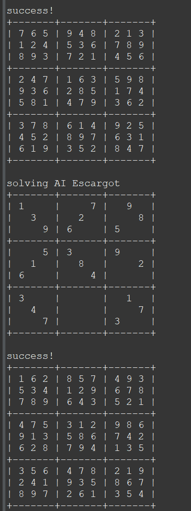

Sudoku Solver is a program that was create as an assignment in ICS 211, Spring 2023. The project helped me learn how to utilize Java and for loops in order to properly solve and fill out a sudoku.

Sudoku Solver was created in Eclipse (an integrated development environment) and written in Java. The SudokuTest class can contain an unsolved sudoku problem that a user can go and input themselves.

In this project I gained experience with Java and different structures. Additionally I gained a better understanding of how Sudoku works in general which can be helpful at times as well but the main thing would be learning and better understanding Java.  

 
Source: <a href="https://github.com/sam4food/sudoku-solver">sam4food/sudoku-solver</a>
