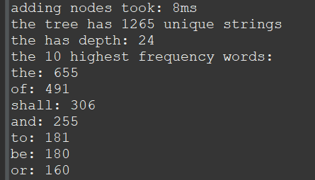

This program was part of an assignment from ICS-211 where it was used to determine the top 10 most frequent words from two different documents. The progrm was written in Java on the IDE Eclipse. What other information this program provides include how long adding nodes took, how many unique strings the tree that is being created from the program has, the depth, and it gives the number of times each of the top 10 words use. 

Although the program may seem simple, the program can be used for mulitple situations. Situations include checking what the top 10 most frequent words in an essay could be which can allow writers to know if they are using a word too frequently or not. 

In this assignment, I managed to learn more about binary search trees and how they work. Additionally, this project helped me improve my Java coding abilities and knowledge which can be greatly helpful in the future for both my career and academic career.

Here is some code that illustrates how the code works:

```java
while (infile.hasNext()) {
			String pword = infile.next();
			//System.out.println(pword);
			StringBuilder sb = new StringBuilder();
			for (int i = 0; i < pword.length(); i++) {
				char ch = pword.charAt(i);
				if (Character.isJavaIdentifierStart(ch)) {
					sb.append(ch);
				}
			}
			String fixStr = sb.toString();
			if (fixStr.length() > 0) {
				wordList.add(fixStr);
				if (fixStr.equals("the")) {
					count++;
				}
			}
		}
		analyze(wordList);
```

Source: <a href="https://github.com/sam4food/word-frequency">sam4food/word-frequency</a>


